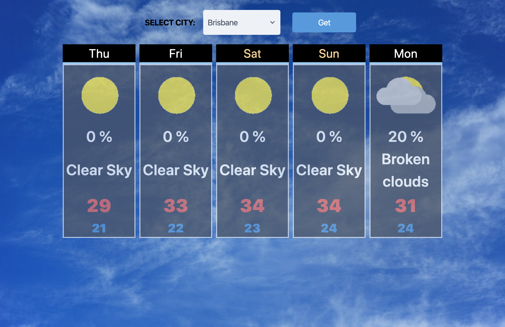
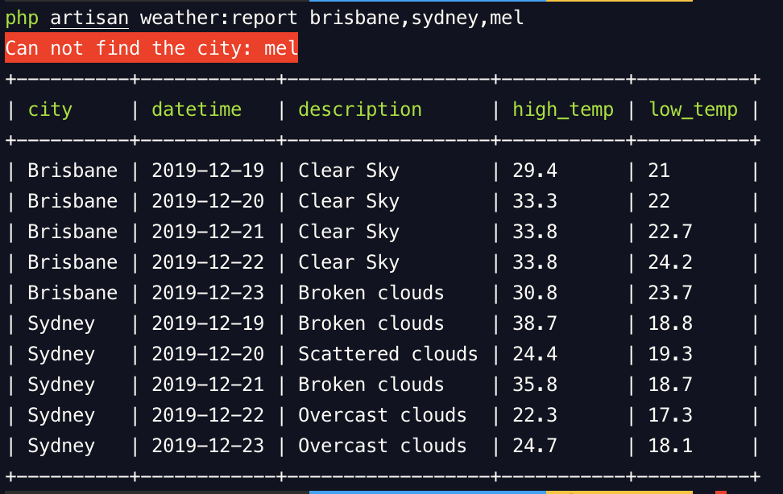

## iSeekPlant code test

## [](https://travis-ci.com/dustinhsiao21/iSeekPlant)[](https://github.styleci.io/repos/228632338)




### Summary
1. Use the [Weatherbit](https://www.weatherbit.io/api/weather-forecast-16-day) API
2. Select a city in Australia and get the 5-day weather forecast. The detail of the cities is stored under `storage/app/city.json` temporary. If there is a table for setting/config in the database, the data should be stored into the database instead of a file. 

3. Back-end:
  
    1. You could use the command below to see the output report.
    
        ```
        php artisan weather:report [city,city,city]
        ```
    
        If the city does not exist, you would get an error message.
    
    2. Implement the WeatherController for API request with request validation.
    
    3. Use Cache to store the forecast data for only one day. Once you send a request to get the forecast data, the data would be cached and the future requests for that data(city) can be served faster.
    
    4. Implement the WeatherService interface, so you could change the weather API by implement the interface.
    
    5. Use TravisCI to run testing and use StyleCI for coding style fixer.
    
    6. Store the icon/pic under the `public/image` directory at this stage. The better way to practice is using AWS services like S3/CloudFront.
    
4. Front-end:

    1. Use React Hook + Tailwind to build the front end layout.
    2. Implement RWD.
    3. Import Momentjs, propTypes.
### Installation

```
cp .env.example .env // Need to update the WEATHERBIT_KEY
composer install
php artisan key:generate
npm install
npm run dev
php artisan serve
```

### Testing

```
./vender/bin/phpunit
```